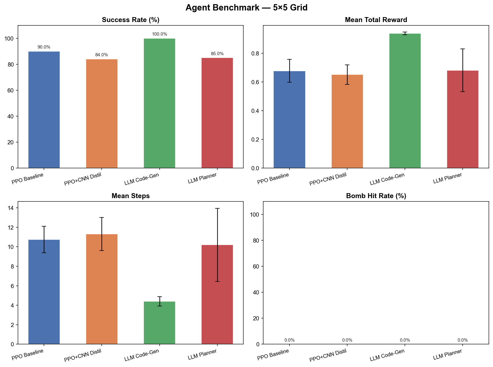
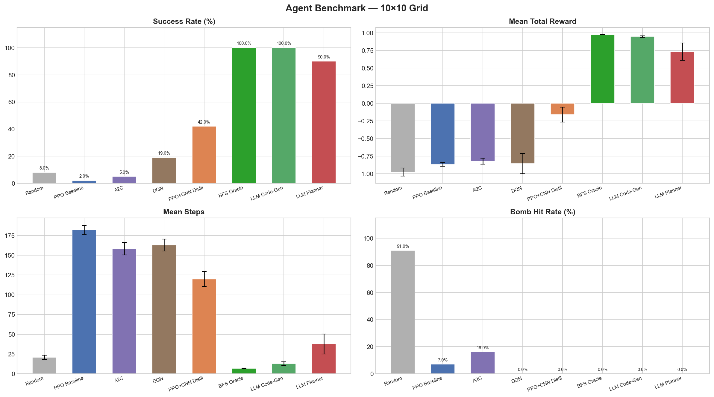

# rlllm_gridworld

Research project comparing RL and LLM-based agents on a custom Gymnasium grid-world navigation task. Eight agent architectures — from pure RL baselines to LLM-driven planners — are implemented and benchmarked on grids from 5×5 to 10×10.

## Environment

An `N×N` grid is randomly generated each episode. The agent starts at a random cell and must reach a target while avoiding bombs. The target and bomb positions change every reset, so no map memorization is possible.

**Observation space** — `Dict`:
- `agent_position`: `Box(2,)` — absolute `(row, col)` coordinates
- `agent_observations`: `Box(5×5)` — local patch centered on the agent (cell types: empty, wall, bomb, target, agent)

The 5×5 window covers only ~4% of a 10×10 grid, making this a **partial-observation** problem. The agent has no direct knowledge of where the target or bombs are outside its immediate vicinity.

**Action space** — `Discrete(4)`: LEFT, RIGHT, UP, DOWN.

**Reward structure**:
| Event | Reward |
|---|---|
| Reach target | +1.0 |
| Hit a bomb | -1.0 (episode ends) |
| Step penalty | `-0.9 / max_steps` |
| Walk into wall | `5 × step_penalty` |

The meaningful rewards (+1 / -1) are sparse — they only trigger at episode termination. The step penalty is scaled so that exhausting all `max_steps = 2×N²` steps costs a total of −0.9, preserving reward scale across grid sizes. This makes the task a **sparse-reward + partial-observation** challenge: pure RL agents struggle to generalize beyond small grids, motivating the LLM-augmented approaches.

Solvability is guaranteed on every reset via BFS — if bombs block all paths to the target, new bomb positions are resampled.

---

## Benchmark

Evaluation: 100 episodes for RL agents, 20 episodes for LLM agents. Bombs: 3 on 5×5, 10 on 10×10.

### 5×5 Grid

| Agent | Success Rate | Mean Reward | Mean Steps | Bomb Hit Rate |
|---|---|---|---|---|
| Random | 22% | -0.945 | 13.7 | 73% |
| PPO Baseline | 85% | 0.606 | 11.9 | 0% |
| A2C | 10% | -0.713 | 44.2 | 2% |
| DQN | 92% | 0.810 | 7.0 | 0% |
| PPO + CNN Distillation | 88% | 0.724 | 9.6 | 0% |
| BFS Oracle | **100%** | **0.954** | **3.6** | 0% |
| LLM Code-Gen | **100%** | 0.947 | 4.0 | 0% |
| LLM Planner | **100%** | 0.932 | 4.8 | 0% |



### 10×10 Grid

| Agent | Success Rate | Mean Reward | Mean Steps | Bomb Hit Rate |
|---|---|---|---|---|
| Random | 8% | -0.978 | 20.8 | 91% |
| PPO Baseline | 2% | -0.870 | 182.3 | 7% |
| A2C | 5% | -0.822 | 158.5 | 16% |
| DQN | 19% | -0.856 | 162.9 | 0% |
| PPO + CNN Distillation | 42% | -0.162 | 119.8 | 0% |
| BFS Oracle | **100%** | **0.974** | **6.8** | 0% |
| LLM Code-Gen | **100%** | 0.947 | 12.8 | 0% |
| LLM Planner | 90% | 0.735 | 37.6 | 0% |



To reproduce, train all RL baselines first (see [Agents](#agents) below), then run:

```bash
python src/evaluation/evaluate_all_agents.py
```

---

## Setup

```bash
pip install -r requirements.txt
```

Create a `.env` file at the project root:

```
DEEPSEEK_API_KEY=sk-...
HUGGINGFACE_HUB_TOKEN=hf_...
```

---

## Agents

### 1. LLM Code-Generation Agent (`src/agent/`)

The LLM generates executable Python code at each step. A `MetaController` decides whether to retrieve a previously stored skill from the skill library (via RAG similarity search) or generate new code with DeepSeek (up to 3 error-recovery retries). Skills accumulate in a JSON library, scored by `mean_reward × √usage_count`; garbage collection keeps the top-k.

Generated code receives `agent_pos`, `known_world`, `go_to(coord)`, and `get_nearest_unknown()`, and must return `(action, is_done)` from a `decide_action()` function.

Skills are learned online during inference — no separate training step.

**Inference**

```bash
# Live demo (random scenario)
python src/agent/inference/inference1.py

# 3 hardcoded scenarios: Great Wall, Maze, Snake
python src/agent/inference/inference2.py
```

---

### 2. LLM High-Level Planner (`src/llm_high_level_planning/`)

`DeepSeekPlanner` asks the LLM for a goal coordinate every N steps. `HighLevelPlannerWrapper` then uses BFS to navigate toward that goal. Falls back to random frontier exploration when the LLM fails or returns an invalid coordinate.

**Inference**

```bash
# Basic run
python src/llm_high_level_planning/inference/inference1.py

# Interactive step-by-step mode
python src/llm_high_level_planning/inference/inference2.py

# 5 hardcoded scenarios
python src/llm_high_level_planning/inference/inference3.py
```

**Prompt testing**

```bash
# Single prompt quality test
python src/llm_high_level_planning/testing/promt_testing.py

# A/B comparison between two prompt strategies
python src/llm_high_level_planning/testing/promt_AB_testing.py
```

Results are written to `src/llm_high_level_planning/testing/*.csv`.

---

### 3. PPO Baseline (`src/ppo_baseline/`)

Pure RL — no LLM. Uses `MultiInputPolicy` with 4 parallel environments and trains for 600k steps. Provides a performance baseline for comparing the LLM-augmented approaches.

**Training**

```bash
# 5×5 grid
python src/ppo_baseline/training/ppo_agent_size5.py

# 10×10 grid
python src/ppo_baseline/training/ppo_agent_size10.py
```

**Inference**

```bash
# 5×5 grid
python src/ppo_baseline/inference/inference1.py

# 10×10 grid with action probability display
python src/ppo_baseline/inference/inference2.py

# Multi-scenario evaluation
python src/ppo_baseline/inference/inference3.py
```

---

### 4. PPO + LLM Hints (`src/ppo_llmhint/`)

A PPO policy augmented with LLM exploration hints. The LLM advisor produces a suggested action that is appended to the observation vector, giving the policy a learned signal to follow or override.

**Training**

```bash
# 5×5 grid, 20k steps
python src/ppo_llmhint/training/ppo_llm_agent1.py
```

**Inference**

```bash
# Standard run
python src/ppo_llmhint/inference/ppo_llm_inference1.py

# Step-by-step with logit visualization
python src/ppo_llmhint/inference/ppo_llm_inference1.2.py
```

---

### 5. PPO + CNN Knowledge Distillation (`src/ppo_llmhint_conv_distilation/`)

A two-stage pipeline: an LLM teacher generates `(state, action)` pairs offline; a CNN student (`ExplorerCNN`) is trained on those pairs via supervised learning; the trained CNN then provides hints to the PPO policy during training. No LLM is required at runtime.

**Step 1 — Data generation**

`HighLevelPlannerWrapper` (BFS + DeepSeek) acts as the expert. Each episode it navigates the grid; the script records `(state_tensor, action)` pairs from successful episodes (truncated episodes are discarded). The state tensor has 5 channels: `[agent, wall, bomb, target, visited/safe]`.

```bash
# Edit MAP_SIZE and N_EPISODES at the top of the script, then run:
python src/ppo_llmhint_conv_distilation/data/data_generation.py
```

Datasets are saved to `src/ppo_llmhint_conv_distilation/data/dataset_{N}size.pt`. Default: 500 episodes, 50 steps/episode cap.

**Step 2 — CNN training**

`ExplorerCNN` (two conv layers + two FC layers) is trained on the dataset via cross-entropy loss.

```bash
# trains student_cnn_{N}size.pth
python src/ppo_llmhint_conv_distilation/ml_model/train.py
```

**Step 3 — PPO training with CNN hints**

```bash
# 5×5 grid, 600k PPO steps
python src/ppo_llmhint_conv_distilation/train/ppo_llmhint_train_5size.py

# 10×10 grid, 1.2M PPO steps
python src/ppo_llmhint_conv_distilation/train/ppo_llmhint_train_10size.py
```

